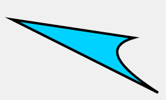
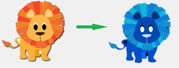

欢迎查看Konva中文文档,这份文档会帮助你快速使用Konva.  
如果你在使用中发现问题和建议,请反馈给我们    

[中文网站 www.konvajs.com](https://www.konvajs.com)

# 什么是Konva?

Konva是一个基于 Canvas 开发的 2d JavaScript框架库, 它可以轻松的实现桌面应用和移动应用中的图形交互交互效果.

Konva 可以实现高性能动画, 过渡, 节点嵌套, 局部操作, 滤镜, 缓存, 事件等功能, 不仅仅适用于桌面与移动开发, 还有更为广泛的应用.

Konva 允许在你舞台上绘图, 添加事件监听, 移动或缩放某个图形, 独立旋转, 以及高效的动画. 即使应用中含有数千个图形也是可以轻松实现的.

项目原著是从KineticJS的[GitHub](https://github.com/ericdrowell/KineticJS)开始。

# Install Konva

如果你使用包管理工具

```
$ npm install konva  

$ # or  

$ bower install konva
```

或者通过CDN下载

完整版[konva.js](https://cdn.rawgit.com/konvajs/konva/1.4.0/konva.js)  
压缩版[konva.min.js](https://cdn.rawgit.com/konvajs/konva/1.4.0/konva.min.js)


#什么是Konva? *What’s Konva?*
Konva是一个基于 Canvas 开发的 2d JavaScript框架库, 它可以轻松的实现桌面应用和移动应用中的图形交互交互效果.

Konva 可以实现高性能动画, 过渡, 节点嵌套, 局部操作, 滤镜, 缓存, 事件等功能, 不仅仅适用于桌面与移动开发, 还有更为广泛的应用.
#它是如何工作  *How does it work?*
一切都是从一个包含了一系列用户的图层`Konva.Layer`的舞台对象`Konva.Stage`开始的  

每个图层都有两个`<canvas>`渲染器：一个场景渲染器以及一个`hit graph`渲染器(隐藏渲染器)。场景渲染器是你所看到的东西,`hit graph`渲染器则是一个特殊的隐藏画布，它被用来实现高性能的点击检测机制。
  
每个图层都可以包含许多形状，形状分组，以及分组的分组。所有的舞台、图层、分组和形状都是节点，就像是HTML页面中的DOM节点一样。

这里有一个节点的层次结构的示例：

                  Stage
	                |
	         +------+------+
	         |             |
	       Layer         Layer
	         |             |
	   +-----+-----+     Shape
	   |           |
	 Group       Group
	   |           |
	   +       +---+---+
	   |       |       |
	Shape   Group    Shape
	           |
	           +
	           |
	         Shape


所有节点都可以被样式化、变换，尽管Konva以及内建了很多形状。比如：三角形，原型，图片，精灵，文本，线条，多边形，正多边形，路径，星型等。

你也可以通过实例化Shape类、并创建一个draw函数来创建自定义的形状。  

每当你准备好一个具有图层和形状的舞台，你就可以绑定事件监听器、节点变换、运行动画、应用滤镜以及做更多事情。  

简单示例：

	// first we need to create a stage *首先我们需要创建一个舞台
	var stage = new Konva.Stage({
	  container: 'container',   // id of container <div> *包裹舞台的DIV元素的ID
	  width: 500,
	  height: 500
	});
	
	// then create layer *然后创建一个图层
	var layer = new Konva.Layer();
	
	// create our shape *创建我们的形状
	var circle = new Konva.Circle({
	  x: stage.getWidth() / 2,
	  y: stage.getHeight() / 2,
	  radius: 70,
	  fill: 'red',
	  stroke: 'black',
	  strokeWidth: 4
	});

	// add the shape to the layer *将形状添加到图层上
	layer.add(circle);
	
	// add the layer to the stage *将图层添加到舞台上
	stage.add(layer);

结果:  


 
##基本形状 *Basic shapes*
`Konva.js` 支持这些形状：矩形，椭圆，线，图像，文字，文字路径，星型，标签，SVG路径，正多边形  
你也可以创建自定义的形状：  

     var triangle = new Konva.Shape({
	      sceneFunc: function(context) {
	        context.beginPath();
	        context.moveTo(20, 50);
	        context.lineTo(220, 80);
	        context.quadraticCurveTo(150, 100, 260, 170);
	        context.closePath();
	
	        // special Konva.js method
	        context.fillStrokeShape(this);
	      },
	      fill: '#00D2FF',
	      stroke: 'black',
	      strokeWidth: 4
	});

结果:  



##样式  *Styles*
每个形状都支持以下的样式属性：  

- Fill. Solid color, gradients or images *填充：纯色，渐变或者图像纹理
- Stroke (color, width) *描边：颜色，宽度
- Shadow (color, offset, opacity, blur) *阴影：颜色，偏移，透明度，模糊度
- Opacity *透明度

示例:  
      
    var pentagon = new Konva.RegularPolygon({
    	x: stage.getWidth() / 2,
    	y: stage.getHeight() / 2,
    	sides: 5,
    	radius: 70,
    	fill: 'red',
    	stroke: 'black',
    	strokeWidth: 4,
    	shadowOffsetX : 20,
    	shadowOffsetY : 25,
    	shadowBlur : 40,
    	opacity : 0.5
    	});
结果:


 
##事件  *Events*
使用`Konvajs`，你可以方便地监听用户输入事件（点击，双击，鼠标滑过，触击，连续触击，触摸开始等），属性变更事件（横向缩放变更，填充变更等），和拖拽释放事件（拖拽开始，拖拽移动，托转结束）。   

示例:  
	circle.on('mouseout touchend', function() {
	    console.log('user input');
	});
	
	circle.on('xChange', function() {
	    console.log('position change');
	});
	
	circle.on('dragend', function() {
	    console.log('drag stopped');
	});  
 See [working example](http://konvajs.github.io/docs/events/Binding_Events.html).  
###拖拽和释放  *DRAG AND DROP*
`Konvajs`没有内建的拖拽支持，现在并没有任何拖拽事件（drop,dragenter,dragleave,dragover)
但是,[利用框架，可以轻易地实现这个机制](http://konvajs.github.io/docs/drag_and_drop/Drop_Events.html)。   

启用拖拽只需要设置draggable属性为true。  

    shape.draggable('true');
然后你就可以支持拖拽事件，并[设置移动区域的限制](http://konvajs.github.io/docs/drag_and_drop/Complex_Drag_and_Drop.html)。
    

##滤镜 *Filters*   
`Konvajs`有多重滤镜：模糊，反色，杂色等，[Filters API](http://konvajs.github.io/api/Konva.Filters.html)收录了所有的滤镜。   
示例:  



##动画*Animation*  
你可以使用两种方式创建动画:  

使用`Konva.Animation`的示例:  

	var anim = new Konva.Animation(function(frame) {
	    var time = frame.time, // *时间
	        timeDiff = frame.timeDiff, // *间隔时间
	        frameRate = frame.frameRate; // *帧率
	    // update stuff *用于更新动画状态的代码写在下面
	}, layer);
	anim.start();

使用`Konva.Tween`的示例:   

     var tween = new Konva.Tween({
	        node: rect,
	        duration: 1,
	        x: 140,
	        rotation: Math.PI * 2,
	        opacity: 1,
	        strokeWidth: 6
	});
	tween.play();
	
	// or new shorter method: *或者更简短的新方法：
	circle.to({
	    duration : 1,
	    fill : 'green'
	});   

【译注】:

这里其实是创建动画的两种最常见的方式。

Animation是指每隔一段时间调用一次我们写好的回调，他们会把当前时间、两帧之间的时间差、帧率以传参的方式交给我们，我们则根据这些数据，手动写代码更新画面的状态。

Tween则是描述间隔时间、属性变化之后，让框架自行更新数据。

前者更加灵活，后者更加方便。
##选择器 *Selectors*    
在你创建大型应用时，元素搜索是很有用的。
  
`Konvajs`提供的选择器可以帮你寻找元素。你可以使用`find()`函数（返回一个集合）或者`findOne()`函数(返回集合中的第一个元素)   
 
    var circle = new Konva.Circle({
	        radius: 10,
	        fill: 'red',
	        id : 'face',
	        name : 'red circle'
	});
	layer.add(circle);
	
	// then try to search
	
	// find by type
	layer.find('Circle'); // all circles
	
	// find by id
	layer.findOne('#face');
	
	// find by name (like css class)
	layer.find('.red')  
##序列化和反序列化  *Serialisation and Deserialization*  
你创建的所有对象都可以用JSON的姓氏存储，你可以将它保存在服务器或者HTML5浏览器本地存储里。  
  
    var json = stage.toJSON();
	Also you can restore objects from JSON:
	
	var json = '{"attrs":{"width":578,"height":200},"className":"Stage","children":[{"attrs":{},"className":"Layer","children":[{"attrs":{"x":100,"y":100,"sides":6,"radius":70,"fill":"red","stroke":"black","strokeWidth":4},"className":"RegularPolygon"}]}]}';
	
	var stage = Konva.Node.create(json, 'container');
	Performance  

##性能 *Performance*  
`Konvajs`有很多工具，可以改善你的应用的性能。其中最关键的方法有：  

缓存允许你在缓冲画布上绘制一个元素，然后从那个canvas上绘制元素。在有很多组合节点时，这将会提高你的性能，比如说文本或者具有很多阴影和描边的形状。  

    shape.cache();

 [Demo](http://konvajs.github.io/docs/performance/Shape_Caching.html)  
【译注】：Canvas的矢量绘制性能很差，而位图绘制则稍好。所以将复杂的图形先保存到图片或者另外的画布中，然后做完位图绘制到主画布上，是很常见的优化手法  
分层。这个框架支持多个&lt;canvas&gt;元素，你可以依据自己的判断来放置自己的对象。
  
举个例子，你的应用包含一个复杂的背景很多个移动的形状。你可以为背景准备一个图层，再为其他形状准备另外一个图层。当更新形状的状态时，你就不需要更新背景画布的状态了。  
[Demo](http://konvajs.github.io/docs/performance/Layer_Management.html)  

你可以在这里看到所有可用的性能建议：
<http://konvajs.github.io/docs/performance/All_Performance_Tips.html>


