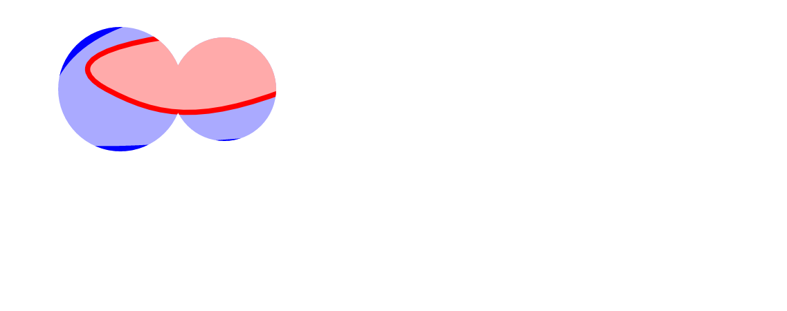

使用`Konva`在剪辑区域内绘制内容，我们可以设置任何容器的`clip`
属性，包括组，图层或舞台。
剪切区域由`x`，`y`，宽度和高度定义。 在本教程中，
我们将在应用于组的矩形剪裁区域内绘制不规则图形。 

  

Konva Clipping Functions Demo [点击查看](https://konvajs.github.io/downloads/code/clipping/Clipping_Function.html)

    <!DOCTYPE html>
    <html>
    <head>
    
    <meta charset="utf-8">
    <title>Konva Clipping Function Demo</title>
    
    </head>
    <body>
    

    
    </body>
    </html>