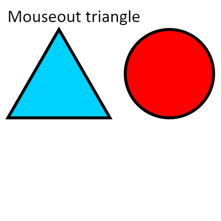

使用`Konva`检测形状事件，我们可以使用`on（）`方法将事件处理程序绑定到节点.  
`on（）`方法需要事件类型和回调函数。
`Konva`支持`mouseover`，`mouseout`，`mouseenter`，`mouseleave`，`mousemove`，`mousedown`，`mouseup`，`wheel`，`click`，`dblclick`，`dragstart`，`dragmove`和`dragend`桌面事件。

    
说明：鼠标悬停和鼠标移出三角形，鼠标悬停，鼠标悬停，鼠标悬停和鼠标悬停在圆圈上  
Konva Binding_Events Demo[点击查看](https://konvajs.github.io/downloads/code/events/Binding_Events.html)    

     <!DOCTYPE html>
     <html>
    <head>
    
    <meta charset="utf-8">
    <title>Konva Shape Events Demo</title>
    
    </head>
    <body>
    

    
    </body>
    </html>