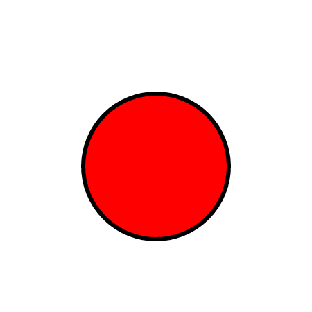

要向使用`Konva`的桌面和移动应用程序工作的形状添加事件处理程序，我们可以使用`on（）`方法并传递配对的事件。    

例如，为了在桌面和移动应用程序上触发`mousedown`事件，我们可以使用“mousedown touchstart”事件对来覆盖这两种媒体。  
  
为了在桌面和移动应用程序上触发mouseup事件，我们可以使用“mouseup touchend”事件对。  

我们还可以使用“dblclick dbltap”事件对来绑定适用于桌面设备和移动设备的双击事件。   

 

说明：在桌面设备或移动设备上进行鼠标移动，鼠标向上，触摸启动或触摸圈子，以观察相同的功能。   

Konva Desktop_and_Mobile Demo[点击查看](https://konvajs.github.io/downloads/code/events/Desktop_and_Mobile.html)

    <!DOCTYPE html>
    <html>
    <head>
    
    <meta charset="utf-8">
    <title>Konva Desktop and Mobile Events Support Demo</title>
    
    </head>
    <body>
    

    
    </body>
    </html>