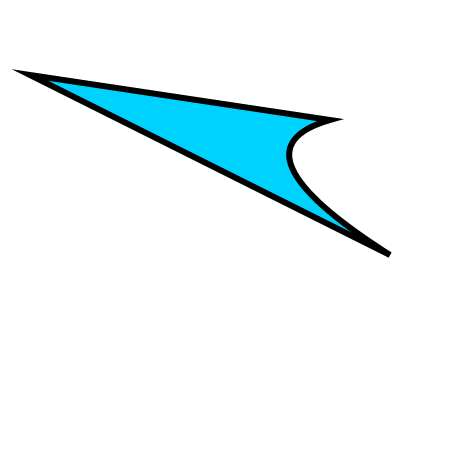

要使用`Konva`创建自定义形状, 我们可以实例化一个`Konva.Shapew()`对象.  
当创建自定义形状时,我们需要定义一个通过Konva.Canvas渲染器传递的绘图函数.
我们可以使用渲染器来访问HTML5 Canvas上下文,并使用像`context.fillStrokeShape(this)`这样的特殊方法,它会自动处理填充,描边和阴影.

有关属性和方法的完整列表,请参阅[Konva.Shape](https://konvajs.github.io/api/Konva.Shape.html)文档

   

 Konva Shape Demo   [点击查看](https://konvajs.github.io/downloads/code/shapes/Custom.html)      

    <!DOCTYPE html>
    <html>
    <head>
    
    <meta charset="utf-8">
    <title>Konva Custom Shape Demo</title>
    
    </head>
    <body>
    

     
    </body>
    </html>