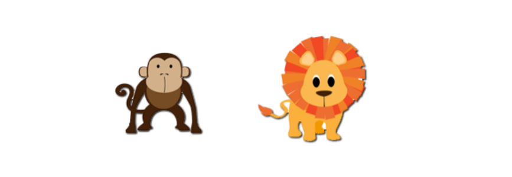

#使用`Konva`的HTML5 Canvas 图片事件  

为了仅使用`Konva`检测图像中非透明像素的事件，我们可以使用`drawHitFromCache（）`方法生成更精确的图像命中区域。  
默认情况下，即使图片内部的像素透明，也可以触发事件。 `drawHitFromCache（）`方法还接受一个可选的回调函数，以便在创建图像匹配区域时执行。  
注意：`drawHitFromCache（）`方法要求图像托管在与执行它的代码相同域的Web服务器上。  
 
说明：将鼠标放在猴子和狮子上，观察mouseover事件绑定。 请注意，如果您将鼠标悬停在图片的任何部分（包括透明像素）上，则会为猴子触发事件。 因为我们为狮子创建了图像命中区域，所以忽略透明像素，这使得能够进行更精确的事件检测。     
Konva Image_Events Demo[点击查看](https://konvajs.github.io/downloads/code/events/Image_Events.html)  

    <!DOCTYPE html>
    <html>
    <head>
    
    <meta charset="utf-8">
    <title>Konva Image Events Demo</title>
    
    </head>
    <body>
    

    
    </body>
    </html>