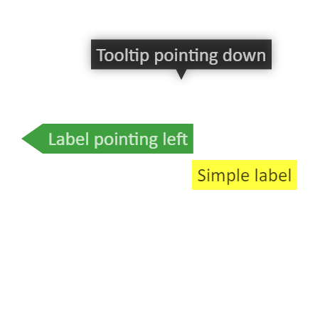

要使用`Konva`创建标签,可用于创建带有背景,简单工具提示或带指针提示的文本. 我们可以实例化一个`Konva.Lable()`对象.

有关属性和方法的完整列表,请参阅[Konva.Lable](https://konvajs.github.io/api/Konva.Label.html)文档

   

 Konva Lable Demo   [点击查看](https://konvajs.github.io/downloads/code/shapes/Label.html)    
  

    <!DOCTYPE html>
    <html>
    <head>
    
    </body>
    </html>