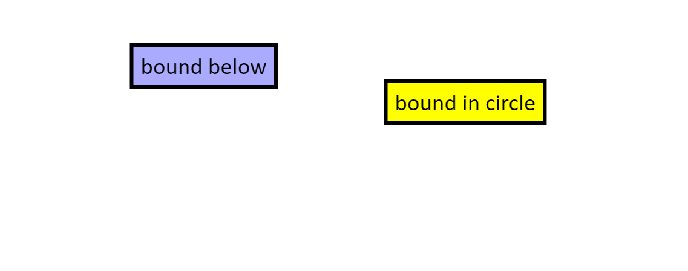

要使用`Konva`限制节点在区域内的被拖放运动，我们可以使用`dragBoundFunc`属性来定义边界,
节点不能交叉。 

说明：拖放浅蓝色矩形并观察它
在y = 50的虚拟边界下面。拖放黄色
矩形并观察它被绑定在一个假想圆内。  

Konva Complex Drag and Drop Bounds Demo[点击查看](https://konvajs.github.io/downloads/code/drag_and_drop/Complex_Drag_and_Drop.html) 

    <!DOCTYPE html>
    <html>
    <head>
    
    <meta charset="utf-8">
    <title>Konva Complex Drag and Drop Bounds Demo</title>
    
    </head>
    <body>
    

    
    </body>
    </html>